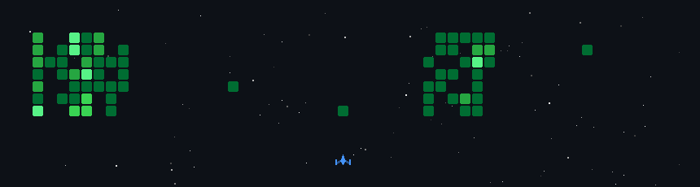

<h1 align="center">Hi  I'm Surendhar Gonela</h1>
<h3 align="center">DevOps & AWS Cloud Engineer | 4 Years | Hyderabad, India</h3>

   
  
  
  
  <!-- <a href="https://www.github.com/gsurendhar"> -->
  </a> 

---

## 🚀 About Me

I don't just deploy applications — I **build reliable, secure, and scalable cloud environments** that help engineering teams deliver faster with confidence.

- 🔧 **4+ years** of hands-on experience in cloud infrastructure, CI/CD automation, Kubernetes, DevSecOps, and IaC
- ☁️ Deep expertise in **AWS, Terraform, Docker, Kubernetes, Jenkins, GitHub Actions, and Helm**
- 📉 Implemented DevSecOps quality gates that **reduced pre-release vulnerabilities by ~40%**
- 🚀 Designed reusable CI/CD frameworks **adopted across multiple projects**
- 📊 Built observability pipelines with **Prometheus, Grafana, and ELK Stack**
- 🌱 Currently learning **Azure Cloud**
- 📝 I share knowledge on AWS, Kubernetes, Linux, and DevOps on **Medium & LinkedIn**
- 📫 Reach me at **gsurendhar.ai@gmail.com**
- 👥 Open to collaborate on **DevOps & Cloud Projects**

> *"DevOps is more than automation — it's about collaboration, ownership, and building systems that are scalable and easy to maintain."*

---

## 🛠️ Tech Stack

**Cloud & Infrastructure**

**Containers & Orchestration**

**CI/CD & DevSecOps**

**Monitoring & Observability**

**Scripting & Databases**

**Web Servers & OS**

---

## 🌟 Key Highlights

| Area | Achievement |
|---|---|
| 🔐 DevSecOps | Reduced pre-release vulnerabilities by ~40% with automated quality gates |
| ⚙️ CI/CD | Built reusable pipeline frameworks adopted across multiple teams |
| ☸️ Kubernetes | Supported zero-downtime upgrades & production deployments on Amazon EKS |
| 📊 Observability | Improved incident visibility with Prometheus, Grafana & ELK Stack |
| 🐳 Docker | Optimized Docker build efficiency significantly across projects |

---

## 📊 GitHub Stats

<!-- 

  

 -->

  

<!-- 

  

 -->

---

<!-- ## 🏆 GitHub Trophies

  

 -->

---
### ✍️ Random Dev Quote

---
<!-- ## 📌 Featured Repository

[] -->

## 📌 Featured Repository

---

	<picture>
	  <source media="(prefers-color-scheme: dark)"  srcset="https://raw.githubusercontent.com/gsurendhar/gsurendhar/output-3d-contrib/night.svg" />
	  <source media="(prefers-color-scheme: light)" srcset="https://raw.githubusercontent.com/gsurendhar/gsurendhar/output-3d-contrib/day.svg" />
	  
	</picture>

---

<!-- https://github.com/czl9707/gh-space-shooter/tree/main -->

  <!--  -->
   
  <i>Thanks for visiting! Let's build reliable infrastructure together. </i>

